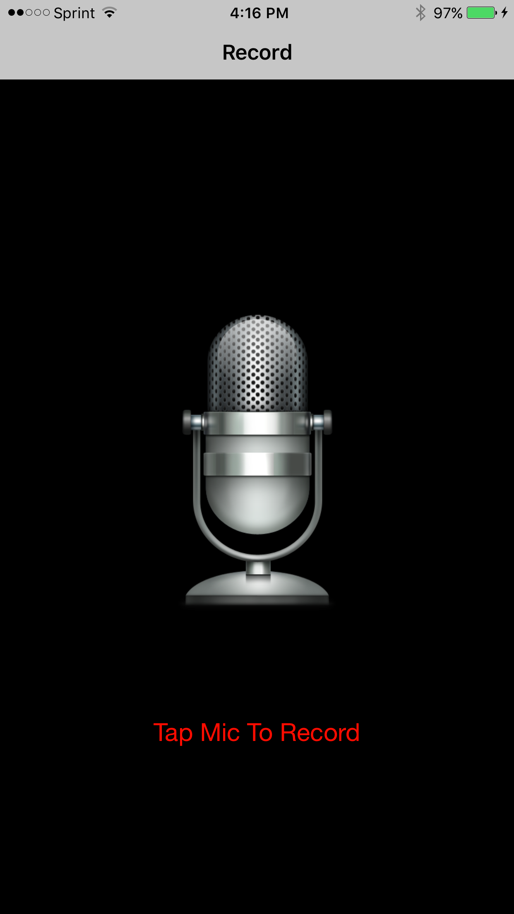
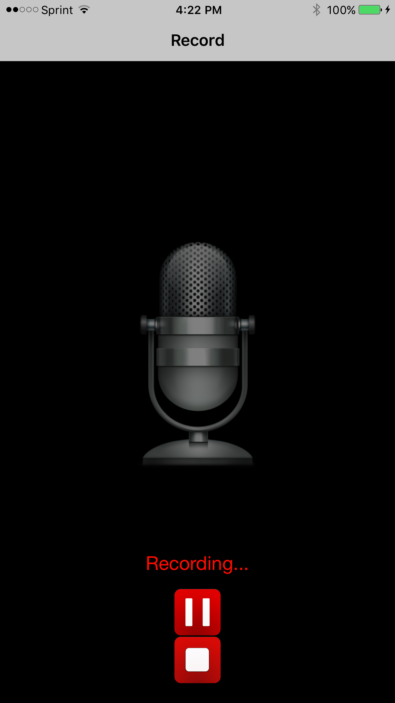
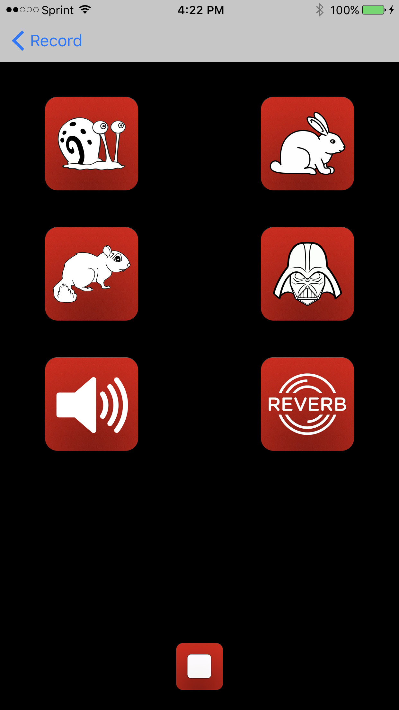

# Pitch-Perfect
### iOS Development Nanodegree Project

Pitch Perfect is an application written in swift built for Udacity's iOS Developer Nanodegree course to help me better understand working with AVFoundation.

The App allows users to Record a sound using the Device’s Microphone. The user can then play the recorded sound back with six different Sound Modulations:  Slow, Fast, Chipmunk, Darth Vader, Reverb, and Echo effect.

Basic features based on the rubric found in [here](https://review.udacity.com/#!/rubrics/19/view)

     

### Implementation

Pitch Perfect has two Scenes:

* __RecordSoundsViewController__ : Contains a microphone image as a record button. Tapping this microphone starts an audio recording session and presents a pause and stop button. When the pause button is clicked, a play button is displayed that the user can press to start the recording where they left off. When the stop button is clicked, the app completes the recording and a segue is triggered to PlaySoundsViewController.

* __PlaySoundsViewController__ : Contains six buttons to play the recorded sound file with different effects related to the button image. A stop button is displayed at the bottom which ends your session and directs you to the recording screen.

The application uses code from AVFoundation to record sounds from the microphone (AVAudioRecorder) and play recorded audio with effects (AVAudioPlayer, AVAudioEngine).

### Requirements
* Xcode 8 Above
* Swift 3.0
